<p align="center">
  
</p>

<h1 align="center">TonbilTerm</h1>

<p align="center">
  <strong>Open-Source Multi-Room Smart Thermostat System</strong><br/>
  ESP8266 Sensors + FastAPI Backend + Next.js Web Panel + Android App
</p>

<p align="center">
  
  
  
  
  
  
  
</p>

---

> **[Turkce README icin asagi kaydiniz](#turkce)** | Scroll down for Turkish README

---

## Overview

TonbilTerm is a complete, self-hosted smart thermostat system that turns any gas boiler into an intelligent, multi-room heating system. Built with affordable ESP8266 (NodeMCU) microcontrollers and BME280 sensors, it provides room-by-room temperature monitoring, automatic boiler control with hysteresis, weekly scheduling, energy analytics, and more.

**No cloud dependency.** Everything runs on your local network with an optional Raspberry Pi server.

<p align="center">
  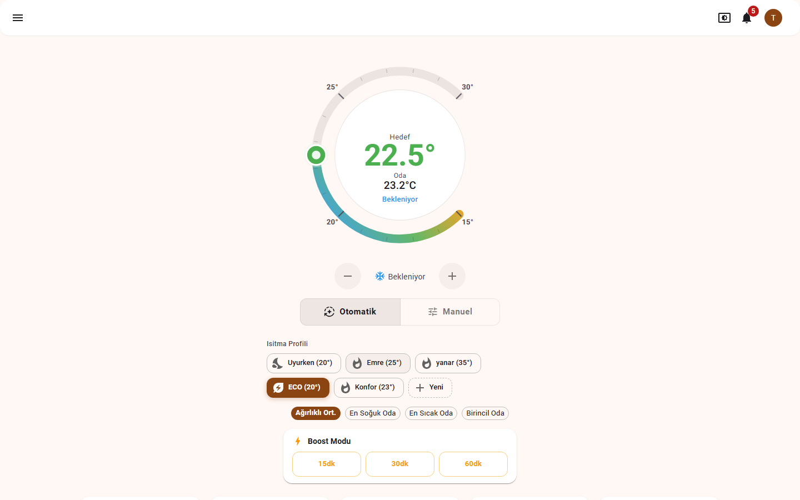
</p>

## Key Features

### Thermostat Control
- **Interactive temperature dial** with target setting and real-time room temperature display
- **Multi-room weighted average** — weighted avg, coldest room, hottest room, or single room strategies
- **Heating profiles** — ECO, Comfort, Sleep, or create custom profiles with one tap
- **Boost mode** — Force heating ON for 15/30/60 minutes, overriding normal control
- **Auto/Manual modes** with seamless switching

### Multi-Room Monitoring

<p align="center">
  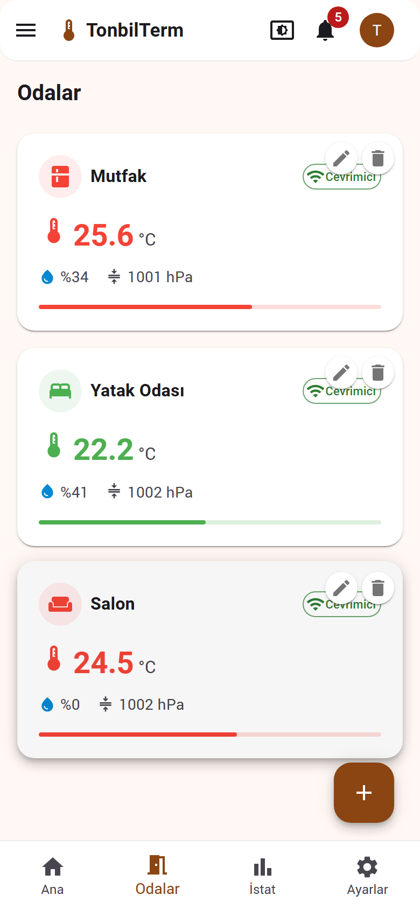
</p>

- **Per-room BME280 sensors** reporting temperature, humidity, and barometric pressure
- **Real-time updates** via MQTT + WebSocket — no polling, instant readings
- **Room weight system** — prioritize rooms that matter most for heating decisions
- **Online/offline status** per sensor device
- **Color-coded temperature bars** showing position within min/max range

### Weekly Scheduler

<p align="center">
  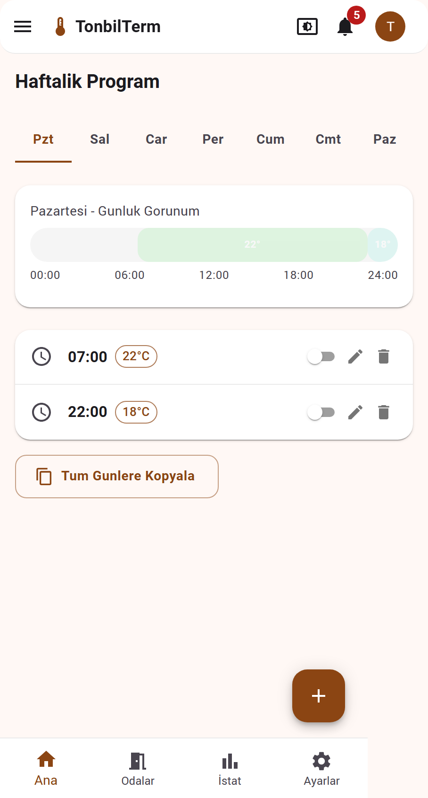
</p>

- **Day-by-day scheduling** with visual timeline
- **Multiple time slots** per day with different target temperatures
- **Copy to all days** for quick setup
- **Enable/disable** individual schedule entries

### Energy Analytics

<p align="center">
  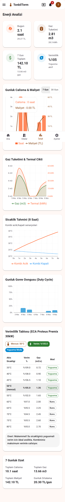
</p>

- **Daily/weekly/monthly** runtime and gas consumption tracking
- **Cost calculation** with configurable gas price (TL/m3)
- **Efficiency analysis** — condensing mode detection, optimal flow temperature recommendations
- **Thermal analysis** — heat loss calculation, net heating balance
- **8-hour temperature prediction** — boiler on/off scenario modeling
- **Duty cycle charts** and gas consumption graphs
- **Boiler efficiency table** — flow temp vs efficiency vs gas consumption matrix
- **Smart alerts** — high energy usage, temperature anomalies, sensor offline warnings

### Device Management
- **Auto-provisioning** — ESP8266 devices register themselves on first boot
- **OTA firmware updates** — update sensors over WiFi
- **MQTT credential management** — automatic per-device user/password generation
- **Device commands** — relay on/off, reboot, config update via MQTT

### Android App

Native Android app with Jetpack Compose and Material 3 design:

- Full thermostat control with interactive dial
- Room monitoring with real-time WebSocket updates
- Energy statistics and alerts
- Weekly scheduler
- Settings and device management
- Dark/Light theme support

### Web Panel Features
- **Progressive Web App (PWA)** — installable on mobile devices
- **Dark/Light theme** with system preference detection
- **Responsive design** — desktop, tablet, and mobile layouts
- **Real-time WebSocket** connection for instant updates
- **Notification bell** with smart alerts and dismiss functionality
- **Weather integration** — outdoor temperature, wind speed, feels-like temperature

## Architecture

```
                    +-----------------+
                    |   Web Panel     |   Next.js 14 (Static Export)
                    |   (Browser)     |   MUI Material, Zustand, React Query
                    +--------+--------+
                             |
                    +--------+--------+
                    |   Android App   |   Kotlin, Jetpack Compose
                    |   (Phone)       |   Ktor, Koin, Material 3
                    +--------+--------+
                             |
                     HTTPS / WSS (TLS @ OpenResty)
                             |
              +--------------+--------------+
              |         Nginx               |   Reverse Proxy + SPA Serving
              +--------------+--------------+
              |              |              |
     +--------+--+  +-------+------+  +----+--------+
     |  FastAPI   |  |  Mosquitto   |  | Static Files|
     |  (API)     |  |  (MQTT)      |  | (Panel)     |
     +-----+------+  +------+-------+  +-------------+
           |                 |
     +-----+------+    +----+----+
     | PostgreSQL  |    | ESP8266 |  x N devices
     | InfluxDB    |    | BME280  |  (sensor/relay/combo)
     | Redis       |    +---------+
     +-------------+
```

### Tech Stack

| Layer | Technology |
|-------|-----------|
| **Firmware** | ESP8266 (NodeMCU v3), Arduino/PlatformIO, BME280, PubSubClient |
| **MQTT Broker** | Eclipse Mosquitto 2.0 with ACL and per-device authentication |
| **Backend API** | Python 3.12, FastAPI, SQLAlchemy (async), Pydantic |
| **Time-Series DB** | InfluxDB 2.7 (sensor data, weather logging) |
| **Relational DB** | PostgreSQL 16 (users, rooms, devices, config, schedules) |
| **Cache** | Redis 7 (weather cache, rate limiting) |
| **Web Frontend** | Next.js 14, React 18, MUI Material, Zustand, TanStack Query |
| **Mobile App** | Kotlin, Jetpack Compose, Ktor, Koin, Material 3 |
| **Infrastructure** | Docker Compose, Nginx, OpenResty (TLS), Raspberry Pi |

## Hardware

### Bill of Materials

| Component | Quantity | Purpose | Approx. Cost |
|-----------|----------|---------|--------------|
| NodeMCU ESP8266 v3 | 1 per room + 1 for relay | WiFi microcontroller | ~$3 |
| BME280 sensor module | 1 per room | Temperature, humidity, pressure | ~$2 |
| 5V Relay module | 1 | Boiler on/off control | ~$1 |
| Raspberry Pi 3/4/5 | 1 | Server (Docker host) | ~$35-75 |
| 5V USB power supplies | 1 per device | Power | ~$2 |
| Dupont wires | As needed | Connections | ~$1 |

### Wiring Diagram

**Sensor Node (BME280):**
```
NodeMCU          BME280
--------         ------
3.3V    -------> VCC
GND     -------> GND
D2 (GPIO4) ---> SDA
D1 (GPIO5) ---> SCL
```

**Relay Node (Boiler Control):**
```
NodeMCU          Relay Module        Boiler
--------         ------------        ------
D5 (GPIO14) ---> IN                  
3.3V/5V   -----> VCC                 
GND       -----> GND                 
                 COM  -------------> Thermostat wire
                 NO   -------------> Thermostat wire
```

**Combo Node (Sensor + Relay):**
Both sensor and relay connected to a single NodeMCU — ideal for the room where the boiler is located.

### Firmware Variants

| Variant | Directory | Description |
|---------|-----------|-------------|
| `sensor` | `firmware/sensor/` | BME280 temperature/humidity/pressure readings only |
| `relay` | `firmware/relay/` | Relay control only (boiler switching) |
| `combo` | `firmware/combo/` | Both sensor + relay in one device |

Each firmware variant includes:
- **WiFi Provisioning** — captive portal for first-time WiFi setup
- **Auto-provisioning** — automatic server registration and MQTT credential fetch
- **Local Fallback** — standalone hysteresis control when server is unreachable
- **Boost Mode** — force heating on for a set duration
- **OTA Updates** — over-the-air firmware updates
- **Freeze Protection** — emergency heating at 5 deg C regardless of mode
- **Configurable via MQTT** — target temp, mode, hysteresis, all adjustable remotely

## Installation

### Prerequisites
- Raspberry Pi (or any Linux machine) with Docker and Docker Compose
- NodeMCU ESP8266 boards + BME280 sensors
- PlatformIO (for firmware flashing)
- Node.js 18+ (for web panel build)
- Android Studio (optional, for mobile app)

### 1. Clone the Repository

```bash
git clone https://github.com/TonbiLX/TonbilTermostat.git
cd TonbilTermostat
```

### 2. Server Setup

```bash
cd server

# Configure environment (optional — defaults work for local setup)
cp .env.example .env
# Edit .env with your settings

# Start all services
docker compose up -d
```

This starts: PostgreSQL, InfluxDB, Redis, Mosquitto, FastAPI, and Nginx.

### 3. Web Panel Build & Deploy

```bash
cd panel
npm install
npm run build    # Creates static export in out/

# Copy out/ contents to nginx static volume
# (see server/scripts/ for deployment helpers)
```

Access the panel at `http://<your-pi-ip>:8091`

### 4. Flash Firmware

```bash
cd firmware/sensor   # or relay/ or combo/

# First flash via USB:
pio run -t upload --upload-port COM8

# Subsequent updates via OTA:
pio run -t upload --upload-port <device-ip>
```

On first boot, the device creates a WiFi hotspot (`TonbilTerm-XXXX`). Connect to it, enter your WiFi credentials, and the device auto-registers with the server.

### 5. Android App (Optional)

```bash
cd app
./gradlew assembleDebug
# Install via: adb install app/build/outputs/apk/debug/app-debug.apk
```

## Screenshots

### Web Panel

| Dashboard | Rooms | Schedule | Analytics |
|-----------|-------|----------|-----------|
| 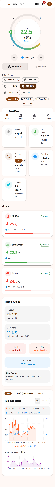 |  |  |  |

| Login | Devices | Settings |
|-------|---------|----------|
| 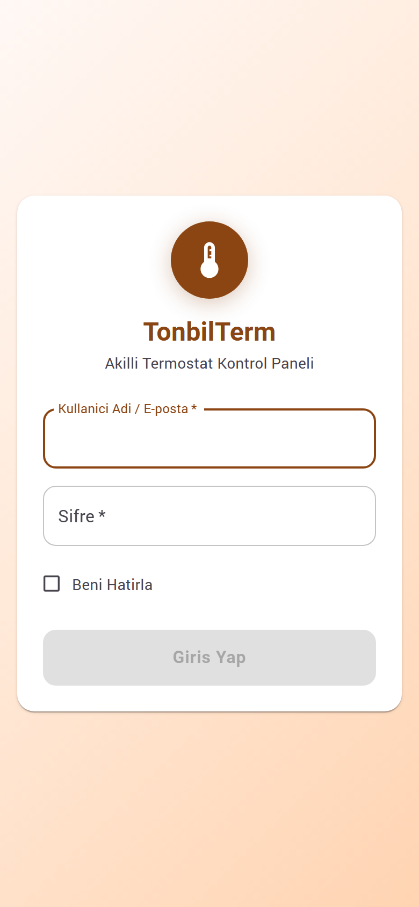 | 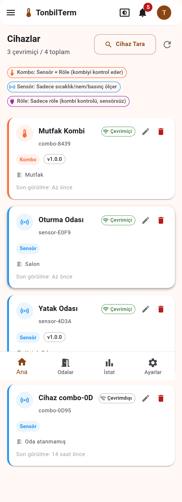 | 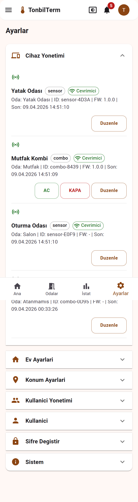 |

### Desktop View

<p align="center">
  
</p>

### Android App

| Login | Dashboard | Rooms | Room Detail |
|-------|-----------|-------|-------------|
| 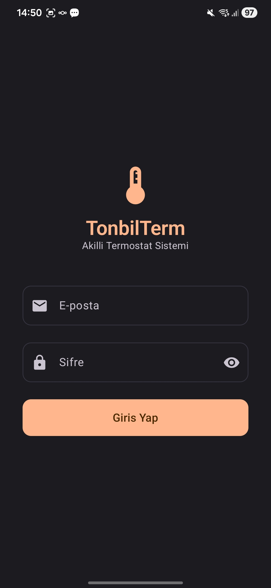 | 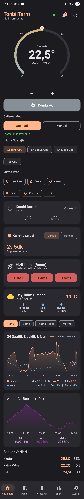 | 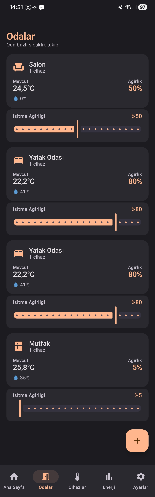 | 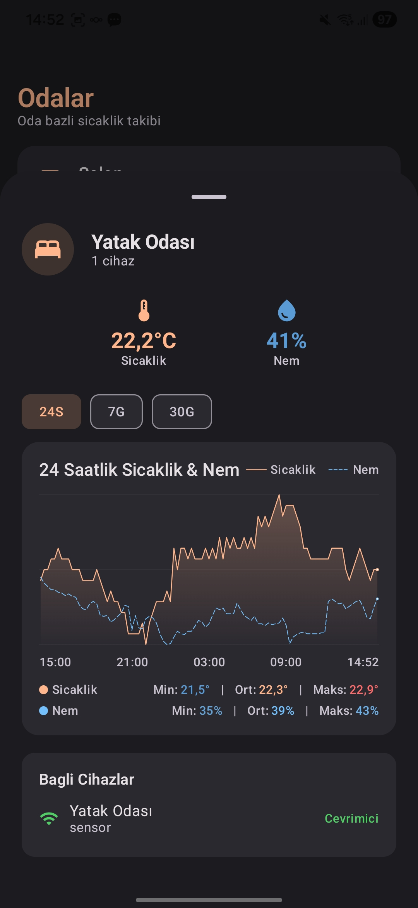 |

| Add Room | Devices | Energy | Settings |
|----------|---------|--------|----------|
| 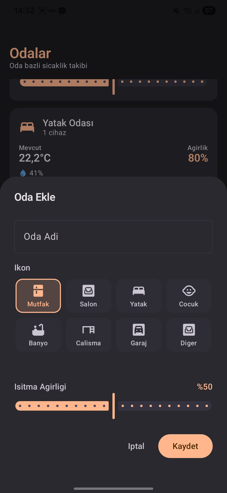 | 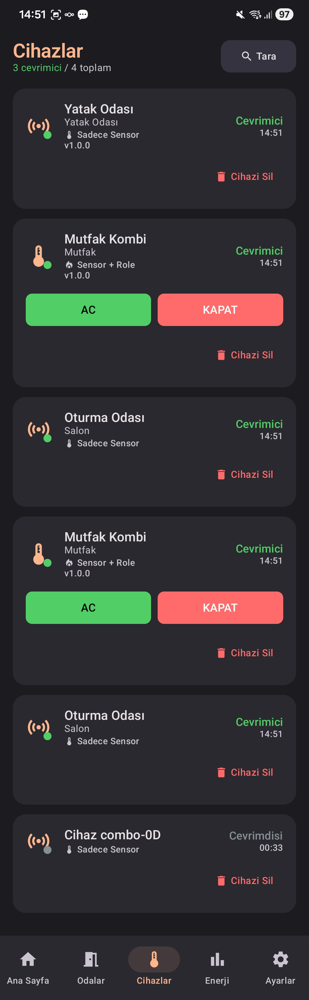 | 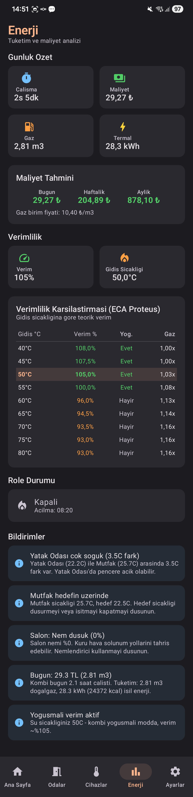 | 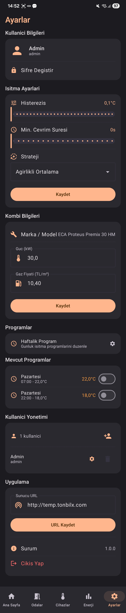 |

## Heating Algorithm

TonbilTerm uses a **hysteresis-based control algorithm** with multiple strategies:

1. **Temperature Reading** — Collects readings from all room sensors
2. **Strategy Selection** — Weighted average, coldest room, hottest room, or single room
3. **Hysteresis Check** — Prevents rapid on/off cycling (configurable, default 0.5 deg C)
4. **Minimum Cycle Time** — Enforces minimum on/off duration to protect the boiler
5. **Relay Command** — Sends MQTT command to relay device
6. **Periodic Re-evaluation** — Checks every 30 seconds even without new telemetry

### Safety Features
- **Freeze protection** at 5 deg C — relay turns ON regardless of mode
- **Maximum runtime limit** — prevents runaway heating
- **Local fallback** — if server goes offline, ESP8266 runs standalone hysteresis
- **Minimum cycle time** — protects boiler compressor from short cycling

## API Documentation

When running in debug mode, API docs are available at:
- Swagger UI: `http://<server>:8091/api/docs`
- ReDoc: `http://<server>:8091/api/redoc`

### Key Endpoints

| Endpoint | Method | Description |
|----------|--------|-------------|
| `/api/auth/login` | POST | Authenticate and get JWT cookie |
| `/api/auth/me` | GET | Current user info |
| `/api/rooms` | GET | List all rooms with live temperatures |
| `/api/sensors/history` | GET | Time-series sensor data |
| `/api/config/heating` | GET/PUT | Heating configuration |
| `/api/config/schedules` | GET/PUT | Weekly schedule |
| `/api/config/boost` | POST/DELETE | Boost mode control |
| `/api/config/profiles` | GET/POST | Heating profiles |
| `/api/energy/current` | GET | Current energy stats |
| `/api/energy/alerts` | GET | Smart alerts |
| `/api/energy/daily` | GET | Daily energy consumption |
| `/api/weather/current` | GET | Current outdoor weather |
| `/api/devices` | GET | List all devices |
| `/ws` | WebSocket | Real-time telemetry stream |

## Contributing

Contributions are welcome! Please feel free to submit a Pull Request.

## License

This project is licensed under the MIT License — see the [LICENSE](LICENSE) file for details.

---

<a name="turkce"></a>

<p align="center">
  
</p>

<h1 align="center">TonbilTerm</h1>

<p align="center">
  <strong>Acik Kaynakli Cok Odali Akilli Termostat Sistemi</strong><br/>
  ESP8266 Sensorler + FastAPI Sunucu + Next.js Web Panel + Android Uygulama
</p>

---

## Genel Bakis

TonbilTerm, herhangi bir dogalgaz kombisini akilli, cok odali bir isitma sistemine donusturen eksiksiz, kendi sunucunuzda calistirabileceginiz bir akilli termostat sistemidir. Uygun fiyatli ESP8266 (NodeMCU) mikrodenetleyiciler ve BME280 sensorler ile olusturulmustur. Oda oda sicaklik takibi, histerezisli otomatik kombi kontrolu, haftalik zamanlama, enerji analizi ve daha fazlasini sunar.

**Bulut bagimliligi yoktur.** Her sey yerel aginizda, opsiyonel bir Raspberry Pi sunucu ile calisir.

## Temel Ozellikler

### Termostat Kontrolu
- **Interaktif sicaklik kadrani** — hedef sicaklik ayari ve anlik oda sicakligi gosterimi
- **Cok odali agirlikli ortalama** — agirlikli ortalama, en soguk oda, en sicak oda veya tekli oda stratejileri
- **Isitma profilleri** — ECO, Konfor, Uyku veya tek dokunusla ozel profiller olusturun
- **Boost modu** — Normal kontrolu atlayarak 15/30/60 dakika zorla isitma
- **Otomatik/Manuel modlar** — sorunsuz gecis

### Cok Odali Izleme
- **Her odada BME280 sensoru** — sicaklik, nem ve atmosfer basinci
- **Anlik guncellemeler** — MQTT + WebSocket ile sifir gecikme
- **Oda agirlik sistemi** — isitma kararlari icin oncelikli odalar
- **Cevrimici/cevrimdisi durum** takibi
- **Renk kodlu sicaklik cubugu** — min/max aralik icinde konum

### Haftalik Zamanlayici
- **Gun gun zamanlama** — gorsel zaman cizelgesi
- **Gun icinde birden fazla zaman dilimi** — farkli hedef sicakliklar
- **Tum gunlere kopyalama** — hizli kurulum
- **Tek tek etkinlestirme/devre disi birakma**

### Enerji Analizi
- **Gunluk/haftalik/aylik** calisma suresi ve gaz tuketimi takibi
- **Maliyet hesaplama** — yapilandirilabilir gaz fiyati (TL/m3)
- **Verimlilik analizi** — yogusma modu tespiti, optimal akis sicakligi onerileri
- **Termal analiz** — isi kaybi hesaplama, net isitma dengesi
- **8 saatlik sicaklik tahmini** — kombi acik/kapali senaryo modelleme
- **Gorev dongusu grafikleri** ve gaz tuketim grafikleri
- **Kombi verimlilik tablosu** — akis sicakligi vs verimlilik vs gaz tuketimi matrisi
- **Akilli uyarilar** — yuksek enerji tuketimi, sicaklik anomalileri, sensor cevrimdisi uyarilari

### Cihaz Yonetimi
- **Otomatik kayit** — ESP8266 cihazlar ilk acilista kendilerini kaydeder
- **OTA firmware guncellemesi** — sensorleri WiFi uzerinden guncelleyin
- **MQTT kimlik yonetimi** — cihaz basina otomatik kullanici/sifre olusturma
- **Cihaz komutlari** — role acma/kapama, yeniden baslatma, yapilandirma guncelleme

### Android Uygulama
- Interaktif kadranli tam termostat kontrolu
- Anlik WebSocket guncellemeleriyle oda izleme
- Enerji istatistikleri ve uyarilar
- Haftalik zamanlayici
- Ayarlar ve cihaz yonetimi
- Karanlik/Aydinlik tema destegi

### Web Paneli
- **Progressive Web App (PWA)** — mobil cihazlara yuklenebilir
- **Karanlik/Aydinlik tema** — sistem tercihine gore otomatik
- **Responsive tasarim** — masaustu, tablet ve mobil
- **Anlik WebSocket** baglantisi
- **Bildirim zili** — akilli uyarilar ve kaydetme islevi
- **Hava durumu entegrasyonu** — dis sicaklik, ruzgar hizi, hissedilen sicaklik

## Donanim

### Malzeme Listesi

| Bilesen | Adet | Amac | Yaklasik Maliyet |
|---------|------|------|-----------------|
| NodeMCU ESP8266 v3 | Oda basi 1 + role icin 1 | WiFi mikrodenetleyici | ~80 TL |
| BME280 sensor modulu | Oda basi 1 | Sicaklik, nem, basinc | ~50 TL |
| 5V Role modulu | 1 | Kombi acma/kapama | ~25 TL |
| Raspberry Pi 3/4/5 | 1 | Sunucu (Docker) | ~1000-2500 TL |
| 5V USB guc kaynaklari | Cihaz basi 1 | Guc | ~50 TL |
| Dupont kablolar | Gerektiği kadar | Baglantilar | ~20 TL |

### Baglanti Semasi

**Sensor Dugumu (BME280):**
```
NodeMCU          BME280
--------         ------
3.3V    -------> VCC
GND     -------> GND
D2 (GPIO4) ---> SDA
D1 (GPIO5) ---> SCL
```

**Role Dugumu (Kombi Kontrolu):**
```
NodeMCU          Role Modulu         Kombi
--------         -----------         -----
D5 (GPIO14) ---> IN
3.3V/5V   -----> VCC
GND       -----> GND
                 COM  -------------> Termostat kablosu
                 NO   -------------> Termostat kablosu
```

### Firmware Cesitleri

| Cesit | Dizin | Aciklama |
|-------|-------|----------|
| `sensor` | `firmware/sensor/` | Sadece BME280 sicaklik/nem/basinc okuma |
| `relay` | `firmware/relay/` | Sadece role kontrolu (kombi anahtarlama) |
| `combo` | `firmware/combo/` | Tek cihazda hem sensor hem role |

Her firmware cesidi sunlari icerir:
- **WiFi Provisioning** — ilk WiFi kurulumu icin captive portal
- **Otomatik kayit** — sunucuya otomatik kayit ve MQTT kimlik bilgisi alma
- **Yerel yedek** — sunucu erisilemedigi zamanlarda bagimsiz histerezis kontrolu
- **Boost Modu** — belirlenen sure boyunca zorla isitma
- **OTA Guncellemeler** — kablosuz firmware guncellemesi
- **Donma Korumasi** — moddan bagimsiz olarak 5 derecede acil isitma

## Kurulum

### On Kosullar
- Docker ve Docker Compose yuklu Raspberry Pi (veya herhangi bir Linux makine)
- NodeMCU ESP8266 kartlar + BME280 sensorler
- PlatformIO (firmware yukleme icin)
- Node.js 18+ (web panel derlemesi icin)
- Android Studio (istege bagli, mobil uygulama icin)

### 1. Repoyu Klonlayin

```bash
git clone https://github.com/TonbiLX/TonbilTermostat.git
cd TonbilTermostat
```

### 2. Sunucu Kurulumu

```bash
cd server
docker compose up -d
```

Bu komut sirasiyla baslatir: PostgreSQL, InfluxDB, Redis, Mosquitto, FastAPI ve Nginx.

### 3. Web Paneli Derleme

```bash
cd panel
npm install
npm run build
```

Panele `http://<pi-ip-adresi>:8091` adresinden erisin.

### 4. Firmware Yukleme

```bash
cd firmware/sensor   # veya relay/ veya combo/

# USB ile ilk yukleme:
pio run -t upload --upload-port COM8

# Sonraki guncellemeler OTA ile:
pio run -t upload --upload-port <cihaz-ip>
```

Ilk acilista cihaz bir WiFi erisim noktasi olusturur (`TonbilTerm-XXXX`). Buna baglanin, WiFi bilgilerinizi girin, cihaz sunucuya otomatik kaydolur.

### 5. Android Uygulama (Istege Bagli)

```bash
cd app
./gradlew assembleDebug
# Yukleme: adb install app/build/outputs/apk/debug/app-debug.apk
```

## Ekran Goruntuleri

### Web Paneli

| Dashboard | Odalar | Zamanlayici | Enerji |
|-----------|--------|-------------|--------|
|  |  |  |  |

| Giris | Cihazlar | Ayarlar |
|-------|----------|---------|
|  |  |  |

### Masaustu Gorunumu

<p align="center">
  
</p>

### Android Uygulama

| Giris | Dashboard | Odalar | Oda Detay |
|-------|-----------|--------|-----------|
|  |  |  |  |

| Oda Ekle | Cihazlar | Enerji | Ayarlar |
|----------|---------|--------|---------|
|  |  |  |  |

## Isitma Algoritmasi

TonbilTerm, birden fazla strateji ile **histerezis tabanli kontrol algoritmasi** kullanir:

1. **Sicaklik Okuma** — Tum oda sensorlerinden okumalari toplar
2. **Strateji Secimi** — Agirlikli ortalama, en soguk oda, en sicak oda veya tekli oda
3. **Histerezis Kontrolu** — Hizli acma/kapama dongusunu onler (yapilandirilabilir, varsayilan 0.5 derece)
4. **Minimum Cevrim Suresi** — Kombiyi korumak icin minimum acik/kapali suresi uygular
5. **Role Komutu** — MQTT komutu ile role cihazina gonderir
6. **Periyodik Degerlendirme** — Yeni telemetri olmasa bile her 30 saniyede kontrol eder

### Guvenlik Ozellikleri
- **Donma korumasi** 5 derecede — moddan bagimsiz olarak role ACIK
- **Maksimum calisma suresi limiti** — kontrolsuz isitmayi onler
- **Yerel yedek** — sunucu cevrimdisi oldugunda ESP8266 bagimsiz histerezis calistirir
- **Minimum cevrim suresi** — kisa sureli acma/kapamayi onler

## Katkida Bulunma

Katkilarinizi bekliyoruz! Lutfen Pull Request gondermekten cekinmeyin.

## Lisans

Bu proje MIT Lisansi altinda lisanslanmistir — detaylar icin [LICENSE](LICENSE) dosyasina bakin.
